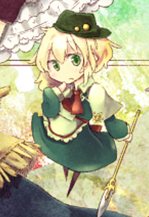
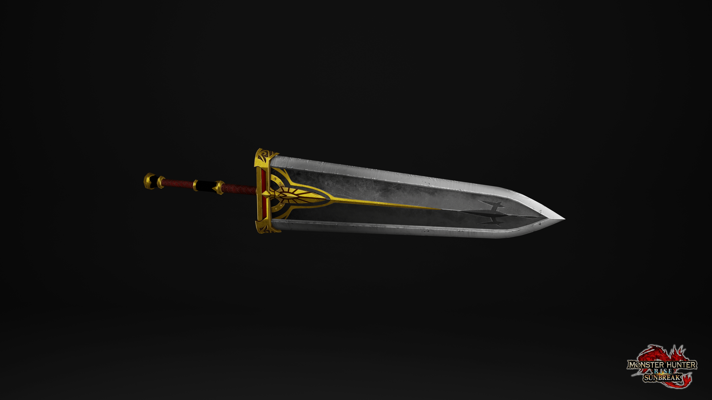
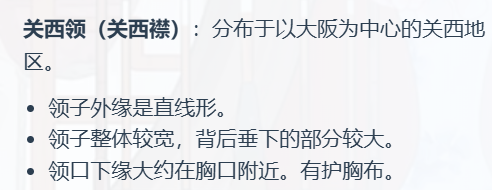

蓬莱人偶

金毛（齐刘海），红瞳，红色连衣裙（底部有金色折线状花纹，带黑色裙摆），暗红色披肩，头后有红色蝴蝶结，背后有简单的透明翅膀，空手

参考图（不过没有翅膀）：

另一张参考图（主要是翅膀，服饰以第一张为准）：

---

法兰西人偶

金毛，蓝瞳，深蓝色连衣裙（带白色围裙），白色披肩，头后有蓝色蝴蝶结，双手持大盾 （省流：和上海人偶除了大蝴蝶结的颜色以外都差不多）

领结无所谓了，因为大盾都挡住了

大盾：主体浅蓝色，边框银白色，中间有金色五芒星（不用六芒星是因为可能有其他含义）

盾牌参考图：

（盾牌的大小也基本上按照这张图，大小足够遮住嘴和以下的部分）

---

京都人偶

金毛，绿瞳，绿色连衣裙（带浅绿色围裙），浅绿色披肩，胸前有红色小蝴蝶结，绿色头巾（带粉色樱花装饰），双手持大剑

从人偶的视角来看，横握大剑，剑柄在身体左前位置，高度大约在腰部，剑尖大约在身体右侧，高度在腿部（不是完全的横握，而是有一点点倾斜，剑尖更低一些）

关于大剑：不需要特别花里胡哨，朴素的厚重大剑就可以，剑体和护手为银白色，剑脊画一条深灰色的线，剑柄为黑色

大剑长度大致和人偶身高相当，但因为人偶朝向右前方，画出来的大剑因为透视的关系会短一些

参考图（只参考服饰，配色参见另一张）：

参考配色（不代表服饰样式）：

大剑外形参考图（随便找的怪猎的大剑，请忽略装饰花纹）：

---

京都人偶·改

浅粉毛，深粉瞳，粉色连衣裙（带白色围裙，底部有一圈樱花图案），白色披肩，胸前有红色小蝴蝶结，女仆头饰，站姿，右手持大镰（主要是因为左手会被挡住）

关于大镰：我也不是很好描述，按照参考图就行

关于大镰的握持姿势：因为大镰太大，又是单手握持，势必会把长柄拿在背后，末端放在地上，大致上就是大镰参考图的姿势左右镜像一下

服装参考图（其实是以前的老图，除了头发换成浅粉、头饰换一下、裙子增加樱花图案以外，基本上是一样的）：

大镰参考图（去掉长柄尾部的锁链）：

---

伦敦人偶

紫毛，金瞳，白色衬衫、红色领带（蓝色领结）、黑色外套，棕色裙子，黑袜黑鞋，紫色斗篷（带蓝色领子），紫色魔女帽（带金色装饰，末端下垂并挂有金色挂饰），右手托着水晶球

省流：原型是魔女之旅的艾丝黛儿（当然考虑到人偶比较小，绝对领域就不用画了）

UPD：把魔女帽的装饰 领带 黑鞋黑袜这几个特征去掉，披风就改成普通的长披风

原型参考图：

---

能量图标

Pixiv 百科事典：“手上总是拿着一本魔导书，用蝴蝶结绑着并且还锁住了。”

棕色封皮，用两条红色丝带十字绑着，中间有一个金色方形锁（中间有锁孔）

封面有暗金色花纹装饰（见参考图）

只画封皮的正面图即可

参考图：

（这张除了封皮颜色不一样和没有花纹，其他的都差不多）

花纹参考图：

（棕色的颜色也大致参考这张，中间的图案因为被锁挡住了，所以可以不画）

---

伦敦人偶（新）

金毛，长发（前面两束卷发，后面是直发），黑色礼帽（带白色蝴蝶结），女仆装（黑色连衣裙，白色围裙、白色裙摆），黑鞋，肩扛一个大扳手

姿势是普通的站姿

省流：与参考图的区别只有头饰和围裙，头饰换成参考图中爱丽丝的帽子（不过不是小帽子，要大一号），围裙换成和其它人偶一样的（中间没有褶的）简单围裙

参考图：

---

荷兰人偶

红毛、红瞳，戴黑色绒帽（两侧有金色勋章装饰；帽子的位置偏后，大致刚好能看到头顶），戴黑色圆框眼镜

白色水手服（关西领，领子部分为棕黄色；胸前有红色三角巾），深红色短裙，黑色鞋

关于关西领：

身前有一本漂浮的打开的书，棕色封面，封面和封底各有半个金色罗盘

站姿，右手微微抬起作握书状（但实际上并没有碰到，毕竟书是漂浮的）

头部参考图：（玩崩铁玩的，另外书的参考图也是这个角色）

水手服样式参考：（萌娘百科的图）

书参考图：（虽然不是严格的书，只是参考一下罗盘样式）

