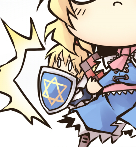

蓬莱人偶

金毛（齐刘海），红瞳，红色连衣裙（底部有金色折线状花纹，带黑色裙摆），暗红色披肩，头后有红色蝴蝶结，背后有简单的透明翅膀，空手

参考图（不过没有翅膀）：

另一张参考图（主要是翅膀，服饰以第一张为准）：

---

法兰西人偶

金毛，蓝瞳，深蓝色连衣裙（带白色围裙），白色披肩，头后有蓝色蝴蝶结，双手持大盾 （省流：和上海人偶除了大蝴蝶结的颜色以外都差不多）

领结无所谓了，因为大盾都挡住了

大盾：主体浅蓝色，边框银白色，中间有金色五芒星（不用六芒星是因为可能有其他含义）

盾牌参考图：

（盾牌的大小也基本上按照这张图，大小足够遮住嘴和以下的部分）
